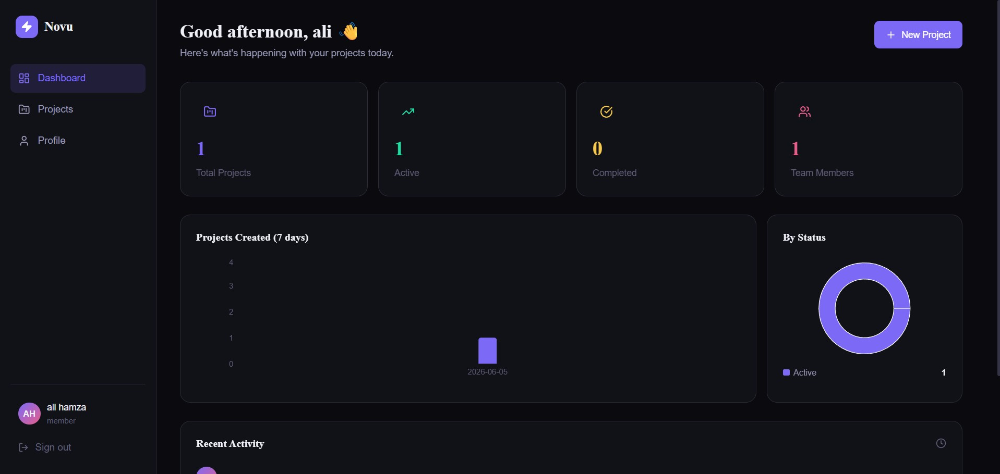
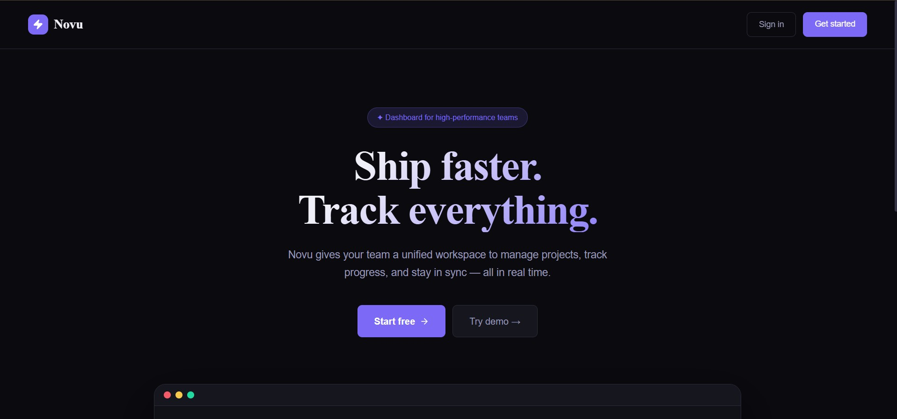
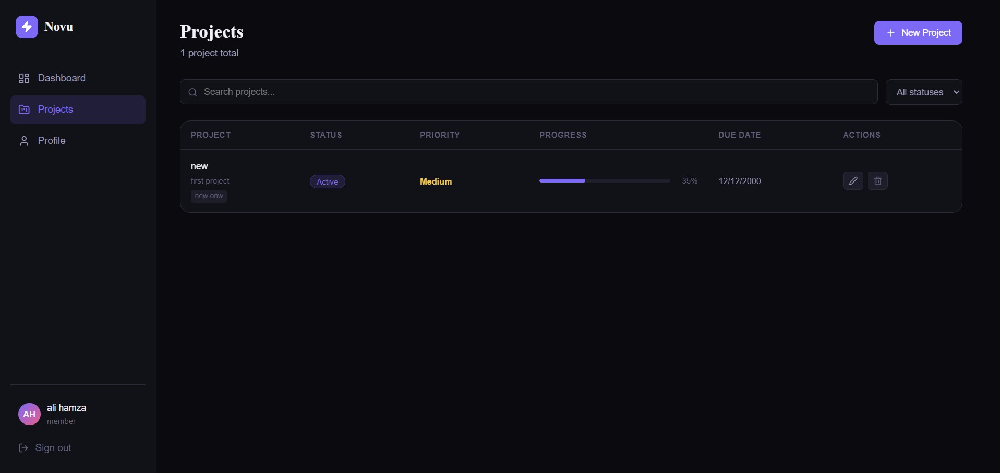
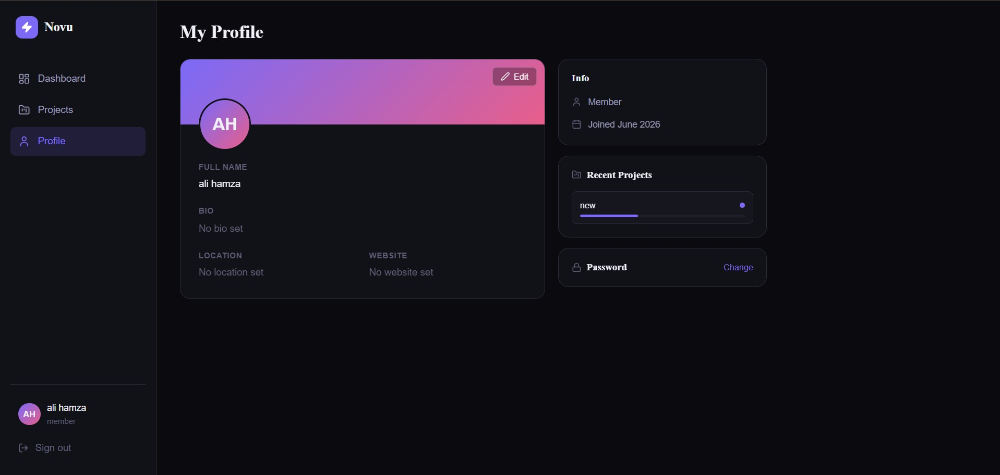

<div align="center">


# Novu — Full-Stack Project Dashboard

**A full-stack dashboard for managing projects, tracking progress, and collaborating with your team.**

[🚀 Live Demo](#) · [📸 Screenshots](#screenshots) · [⚡ Quick Start](#quick-start) · [📡 API Docs](#api-endpoints)

---

<!-- Replace the line below with your actual screenshot after taking one -->


</div>

---

## ✨ Features

| Feature | Details |
|---|---|
| 🔐 Authentication | Register, login, JWT sessions (7-day expiry) |
| 📊 Dashboard | Live stats, bar chart, pie chart, activity feed |
| 📁 Projects | Full CRUD — create, edit, delete, search, filter, paginate |
| 👤 Profile | Edit name, bio, location, website, change password |
| 🌐 Landing Page | Public marketing page with feature overview |
| 📱 Responsive | Mobile-friendly sidebar, adaptive grid layouts |

---

## 🖥️ Screenshots

> 📌 **To add screenshots:** take them after running the app, upload them to `docs/screenshots/` in your repo, then update the image paths below.

### Landing Page


### Dashboard


### Projects


### Profile


---

## 🎬 Demo Video

> 📌 **To add a video:** record a short screen recording (30–60 seconds), upload it to YouTube or Loom (free), then paste the link below.

[](https://your-demo-link-here)

Or paste your Loom/YouTube link directly here.

---

## 🛠️ Tech Stack

### Frontend
- **React 18** — UI framework
- **React Router v6** — client-side routing
- **Recharts** — bar and pie charts
- **Lucide React** — icons
- **Axios** — HTTP client
- **Vite** — build tool and dev server

### Backend
- **Node.js + Express** — REST API server
- **SQLite** via `better-sqlite3` — embedded database, zero setup
- **JWT** — stateless authentication
- **bcryptjs** — password hashing
- **dotenv** — environment config

---

## ⚡ Quick Start

### Prerequisites
- Node.js **v18 or higher**
- npm v8+

### 1. Clone the repository

```bash
git clone https://github.com/Hamzaa6296/dashboard.git
cd dashboard
```

### 2. Set up the backend

```bash
cd backend
cp .env.example .env
npm install
```

Create the data directory if it doesn't exist:
```bash
mkdir data
```

Seed demo data (recommended for first run):
```bash
node src/seed.js
```

Start the backend server:
```bash
npm run dev
```

✅ Backend running at `http://localhost:5000`

### 3. Set up the frontend

Open a **new terminal**:

```bash
cd frontend
npm install
npm run dev
```

✅ Frontend running at `http://localhost:5173`

### 4. Open in browser

Go to **http://localhost:5173**

---

## 🔑 Demo Accounts

After running the seed script, use these to log in instantly:

| Email | Password | Role |
|---|---|---|
| alex@demo.com | password123 | Admin |
| jordan@demo.com | password123 | Member |
| sam@demo.com | password123 | Member |

> The **admin** account can delete any project. Members can only delete their own.

---

## 📡 API Endpoints

Base URL: `http://localhost:5000/api`

All protected routes require the header:
```
Authorization: Bearer <token>
```

### 🔐 Auth

| Method | Endpoint | Auth | Description |
|---|---|---|---|
| POST | `/auth/register` | ❌ | Create new account |
| POST | `/auth/login` | ❌ | Login, returns JWT token |
| GET | `/auth/me` | ✅ | Get current logged-in user |

### 📁 Projects

| Method | Endpoint | Auth | Description |
|---|---|---|---|
| GET | `/projects` | ✅ | List projects (supports `?search=`, `?status=`, `?page=`, `?limit=`) |
| GET | `/projects/:id` | ✅ | Get single project |
| POST | `/projects` | ✅ | Create project |
| PUT | `/projects/:id` | ✅ | Update project (owner or admin only) |
| DELETE | `/projects/:id` | ✅ | Delete project (owner or admin only) |

### 👤 Users

| Method | Endpoint | Auth | Description |
|---|---|---|---|
| GET | `/users` | ✅ | List all users |
| GET | `/users/:id` | ✅ | Get user profile + their recent projects |
| PUT | `/users/:id` | ✅ | Update profile (own account only) |
| PUT | `/users/:id/password` | ✅ | Change password (own account only) |
| DELETE | `/users/:id` | ✅ | Delete account |

### 📊 Stats

| Method | Endpoint | Auth | Description |
|---|---|---|---|
| GET | `/stats/dashboard` | ✅ | Totals, chart data, recent activity |

### Health Check

```bash
GET /api/health
# → { "status": "ok", "timestamp": "..." }
```

---

## 🗂️ Project Structure

```
dashboard/
├── backend/
│   ├── data/                   # SQLite database (auto-created, git-ignored)
│   ├── src/
│   │   ├── index.js            # Express app entry point
│   │   ├── db.js               # Database init and schema
│   │   ├── seed.js             # Demo data seeder
│   │   ├── middleware/
│   │   │   └── auth.js         # JWT verification middleware
│   │   └── routes/
│   │       ├── auth.js         # /api/auth/*
│   │       ├── users.js        # /api/users/*
│   │       ├── projects.js     # /api/projects/*
│   │       └── stats.js        # /api/stats/*
│   ├── .env.example
│   └── package.json
│
├── frontend/
│   ├── src/
│   │   ├── App.jsx             # Route definitions
│   │   ├── main.jsx            # React entry point
│   │   ├── index.css           # Global styles and design tokens
│   │   ├── context/
│   │   │   └── AuthContext.jsx # Auth state and helpers
│   │   ├── components/
│   │   │   └── Layout.jsx      # Sidebar + page wrapper
│   │   ├── pages/
│   │   │   ├── Landing.jsx     # Public landing page
│   │   │   ├── Login.jsx
│   │   │   ├── Register.jsx
│   │   │   ├── Dashboard.jsx   # Stats + charts + activity
│   │   │   ├── Projects.jsx    # Project table + CRUD
│   │   │   └── Profile.jsx     # User profile + edit
│   │   └── utils/
│   │       └── api.js          # Axios instance with auth interceptor
│   ├── index.html
│   └── package.json
│
├── .gitignore
└── README.md
```

---

## ⚙️ Environment Variables

Create `backend/.env` from the example:

```bash
cp backend/.env.example backend/.env
```

| Variable | Default | Description |
|---|---|---|
| `PORT` | `5000` | Backend server port |
| `JWT_SECRET` | `change-this` | Secret key for signing JWT tokens |
| `FRONTEND_URL` | `http://localhost:5173` | Allowed CORS origin |

> ⚠️ Always change `JWT_SECRET` to a long random string in production.

---

## 📝 Assumptions & Limitations

- **SQLite over PostgreSQL** — chosen intentionally for zero-setup simplicity. In production, swap `better-sqlite3` for `pg` and update `db.js` connection logic.
- **No email verification** — registration is instant with no email step.
- **Avatar URLs only** — profile pictures accept a URL string; file upload is not implemented.
- **No real-time updates** — data refreshes on page load or user action. WebSockets were out of scope.
- **Single-node only** — SQLite doesn't support horizontal scaling. A production version would use PostgreSQL with connection pooling.
- **JWT stored in localStorage** — acceptable for this scope; a production app would use httpOnly cookies.

---

## 🚀 Production Build

```bash
# Build frontend
cd frontend
npm run build
# Output is in frontend/dist/ — deploy to Netlify, Vercel, or any static host

# Run backend in production
cd backend
NODE_ENV=production JWT_SECRET=your-long-random-secret npm start
```

---

## 📄 License

MIT — free to use for any purpose.

---

<div align="center">
Built with React · Express · SQLite
</div>
